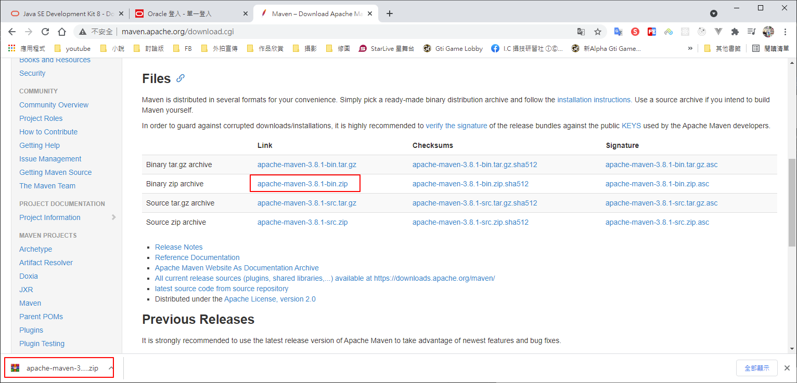
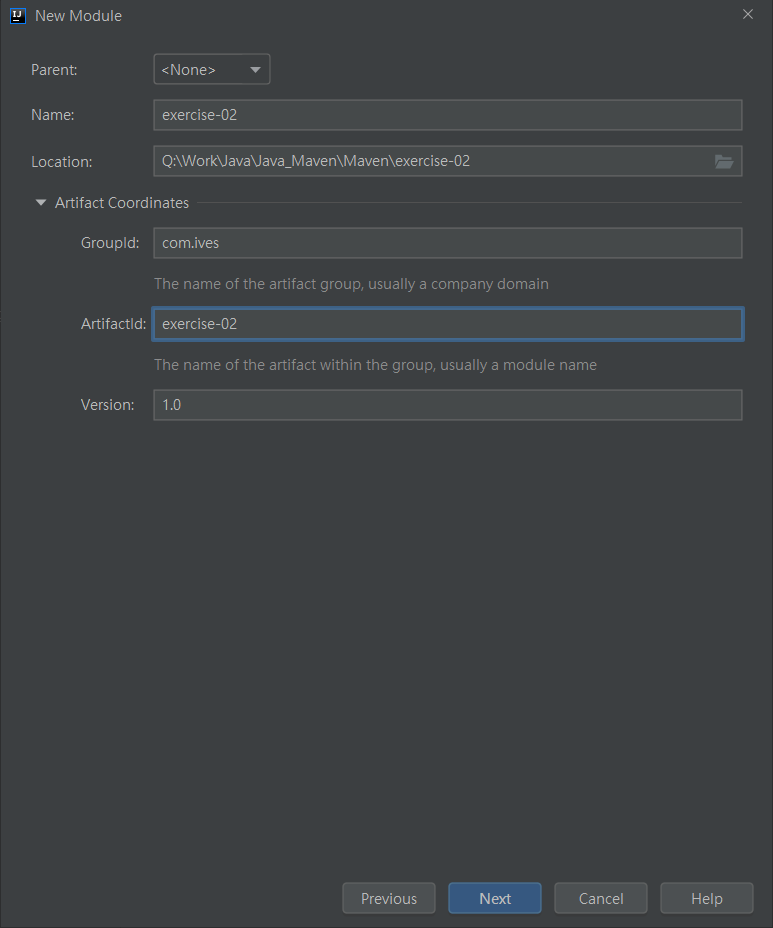
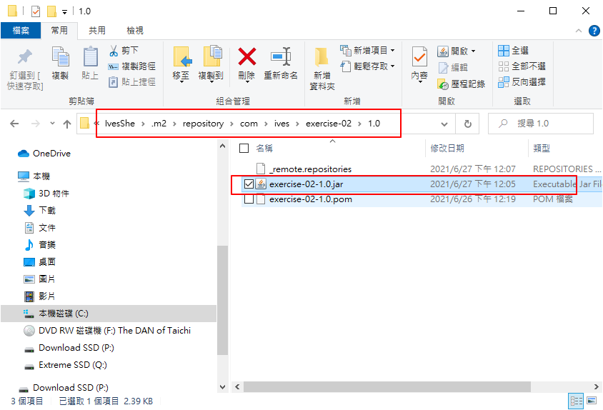
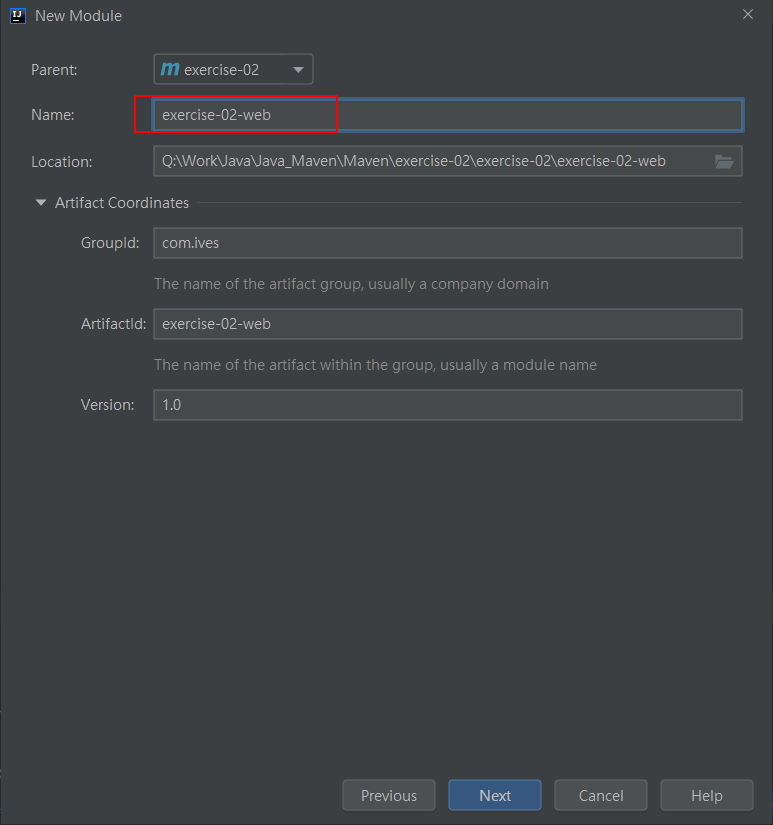
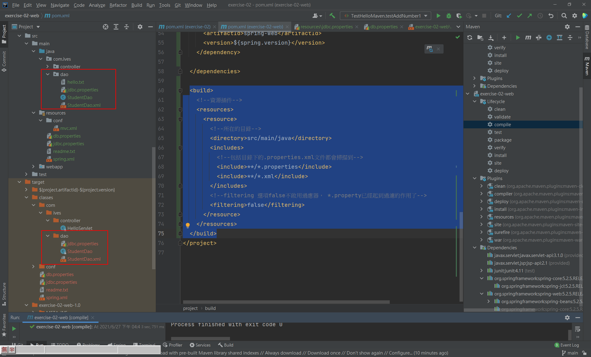

# Java Maven

Maven筆記

# 前置作業

- 安裝JDK1.8
- 安裝IDEA
- 安裝Maven
- IDEA設置Maven
- Maven開啟新專案

# POM

POM：Project Object Model項目對象模型，maven把項目當作模型處理，操作這個模型就是操作項目。

maven通過pom.xml文件實現項目的構建和依賴的管理。

# 座標

確定資源的唯一標識


```xml
<groupId>com.ives</groupId>
<artifactId>exercise-02-web</artifactId>
<version>1.0</version>
```

# Maven 命令

清理
```bash
mvn clean
```

編譯
```bash
mvn compile
```

編譯
```bash
mvn test-compile
```

測試
```bash
mvn test
```

打包
```bash
mvn package
```

安裝
```bash
mvn install
```

# 下載JDK

https://www.oracle.com/java/technologies/javase-downloads.html


# 安裝JDK


# 配置環境變量


# 使用IDEA

官網下載並安裝(選擇64bit)

https://www.jetbrains.com/idea/

# 開啟新專案

選擇剛剛裝好的JDK8


寫個測試


# 安裝Maven

http://maven.apache.org/



設置環境變數


# IDEA設置Maven


Maven創建項目時，會從網路下載一個archetype-catalog.xml作為項目的模板文件，文件有8M左右。

internal表示不用下載文件，加快創建Maven項目的速度

```xml
-DarchetypeCatalog=internal
```


# 修改新專案設定

對新建的或都是導入的項目，也使用同樣的Maven設置


設定與上一個步驟相同

# 創建基於Maven的普通Java項目

創建新專案


創建新模塊


使用Maven模板





建立完成


JDK修改成1.8


資料夾若未有對應顯示，可手動設定


# 撰寫類及測試方法


# Maven操作視窗


## 點擊test可運行單元測試


## 點擊package可生成jar包


## 點擊install可安裝所生成的jar包


檢查預設倉庫的目錄，確實已安裝該jar包



# 新增Web項目





新增對應資料夾及修改pom.xml


# Maven 倉庫

https://mvnrepository.com/artifact/javax.servlet/javax.servlet-api/3.1.0

https://mvnrepository.com/artifact/javax.servlet.jsp/jsp-api/2.1


# 若依賴沒有自動下載需設定


# 安裝Tomcat

下載Tomcat

https://tomcat.apache.org/download-90.cgi


解壓縮後的資料夾結構


win10的運行檔


啟動


測試成功


# IDEA設置Tomcat


# 編寫對應代碼


測試成功


# 若需要導入模塊的設定


導入成功


# 依賴管理

依賴範圍scope：

- compile - 默認，參與構建項目的所有階段
- test - 測試，在測試階段使用
- provided - 提供者，項目在部署到服務器時，不需要提供這個依賴的jar，而是由服務器這個依賴的jar包


默認
```xml
<!-- https://mvnrepository.com/artifact/mysql/mysql-connector-java -->
<dependency>
    <groupId>mysql</groupId>
    <artifactId>mysql-connector-java</artifactId>
    <version>5.1.9</version>
</dependency>
```

測試
```xml
    <!--junit-->
    <dependency>
      <groupId>junit</groupId>
      <artifactId>junit</artifactId>
      <version>4.11</version>
      <scope>test</scope>
    </dependency>
```

提供者
```xml
    <!--jsp依賴-->
    <dependency>
      <groupId>javax.servlet.jsp</groupId>
      <artifactId>jsp-api</artifactId>
      <version>2.1</version>
      <scope>provided</scope>
    </dependency>
```

# 打個war包至Tomcat使用


拷貝到Tomcat webapps目錄


啟動Tomcat


觀察資料夾變化，多了war對應的解壓縮資料夾，裡面即是自行撰寫的資料


資料夾名稱即為訪問的名稱


# Tomcat服務器的lib，即包含Servlet(依賴提供者)


# 常用設置

```xml
<properties>
    <project.build.sourceEncoding>UTF-8</project.build.sourceEncoding>
    <maven.compiler.source>1.8</maven.compiler.source>
    <maven.compiler.target>1.8</maven.compiler.target>
  </properties>
```

- project.build.sourceEncoding - 項目構編使用的編碼
- maven.compiler.source - 源碼編譯jdk版本
- maven.compiler.target - 運行代碼jdk版本

# 全局變量

定義變量

```xml
<properties>
    <!--自訂義變量-->
    <spring.version>5.2.5.RELEASE</spring.version>
    <juint.version>4.11</juint.version>
  </properties>
```

使用所訂義的變量

```xml
  <dependencies>
    <!-- https://mvnrepository.com/artifact/org.springframework/spring-core -->
    <dependency>
      <groupId>org.springframework</groupId>
      <artifactId>spring-core</artifactId>
      <version>${spring.version}</version>
    </dependency>

    <!-- https://mvnrepository.com/artifact/org.springframework/spring-web -->
    <dependency>
      <groupId>org.springframework</groupId>
      <artifactId>spring-web</artifactId>
      <version>${spring.version}</version>
    </dependency>

  </dependencies>
```

# 指定資源位置

資源插件

- maven默認會把src/main/resources目錄中的文件，拷貝到target/classes目錄下
- maven只處理src/main/java目錄下的.java文件，把這些java文件編譯為class，拷貝到target/classes目錄中，不處理其它文件


配置資源插件，使maven會處理src/main/java的配置文件

```xml
<build>
    <!--資源插件-->
    <resources>
      <resource>
        <!--所在的目錄-->
        <directory>src/main/java</directory>
        <includes>
          <!--包括目錄下的.properties.xml文件都會掃描到-->
          <include>**/*.properties</include>
          <include>**/*.xml</include>
        </includes>
        <!--filtering 選項false不啟用過慮器， *.property已經起到過濾的作用了-->
        <filtering>false</filtering>
      </resource>
    </resources>
  </build>
```

